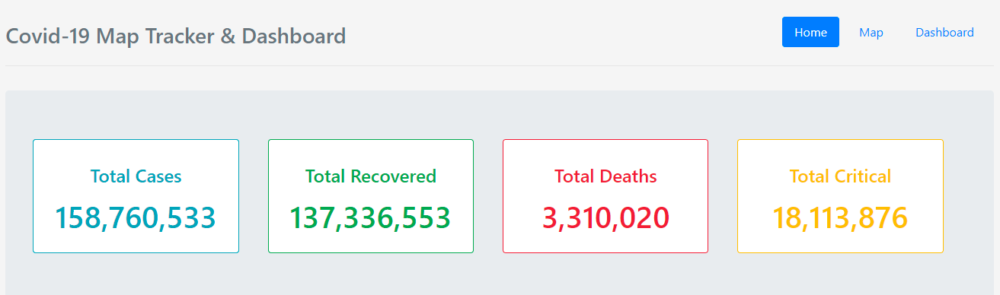
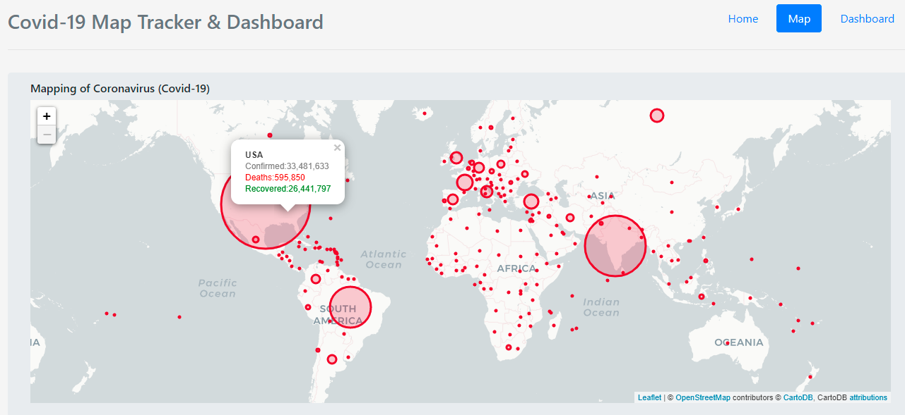
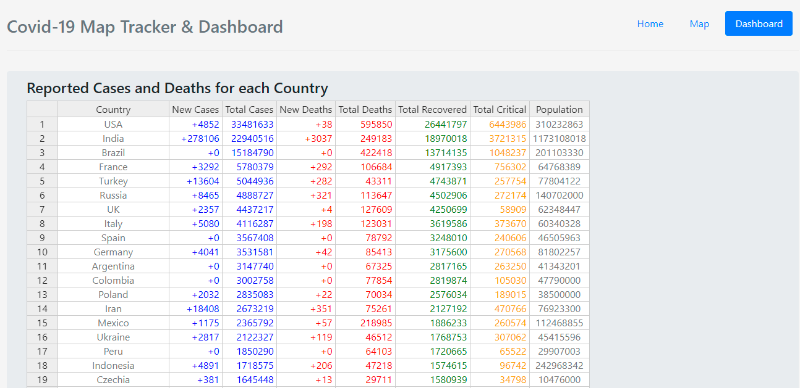

# covid-map-dashboard-tracker

This web application displays a map and Dashboard of the Covid-19 cases around the World. 
Developed using flask framework, folium and JavaScript.

### Prerequisite

Python 3.9.0 available at https://www.python.org/downloads/

### How to set up locally

Download project or clone this repository using:

```sh
$ git clone https://github.com/nahlaerrakik/covid-map-dashboard-tracker.git
```
Install packages in requierement.txt file. If you are using an IDE (PyCharm), allow it to install the required dependencies automatically.

```sh
pip install -r requirements.txt
```
### How to run the project
```sh
python run.py
```
Go to http://127.0.0.1:5000/ to navigate the web application. P.S: The port number may differ.


###  Home


###  Map


###  Dashboard

